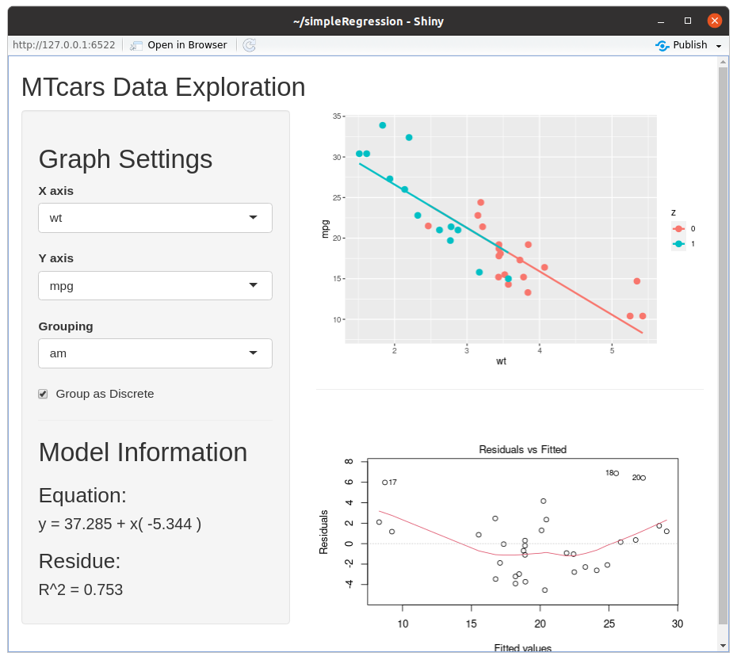

```{r setup, include=FALSE}
knitr::opts_chunk$set(echo = FALSE)
```


## App Objectives

- Quick explore MTCars data set;
- Find relations between variables;
- Simple linear regression model (one regressor);
- Simple Residue Analysis

## Data set: MTCars

- `r dim(mtcars)[1]` Observations;
- `r dim(mtcars)[2]` Variables;


Since the app objective is to speedup and simplify data exploration, it is 
recommended that the user first read the variables description and than 
explore the data or vise versa, <span style= "color:red;">although not reading 
the data set description may lead to hasty conclusions. </span>

R help has a succinct explanation for each variable that can be easily accessed 
with the following code.


```{r echo=TRUE, eval=FALSE}

?mtcars

```


## App UI

<center>{width=60%}</center>
<center>Data Exploration App User Interface</center>

## Links

[Github Project Page](https://github.com/ffrazatto/DevelopingDataProducts)

[Simple Data Explorer]( https://ffrazatto.shinyapps.io/finalassignment/)

[This Presentation](https://ffrazatto.github.io/DevelopingDataProducts//finalAssignment/pitchPresentation.html#1)


